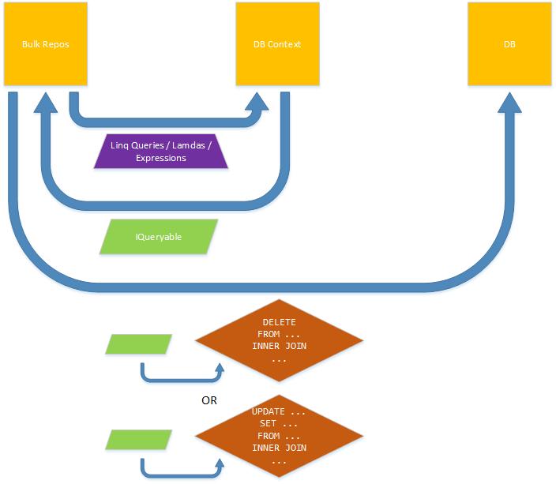
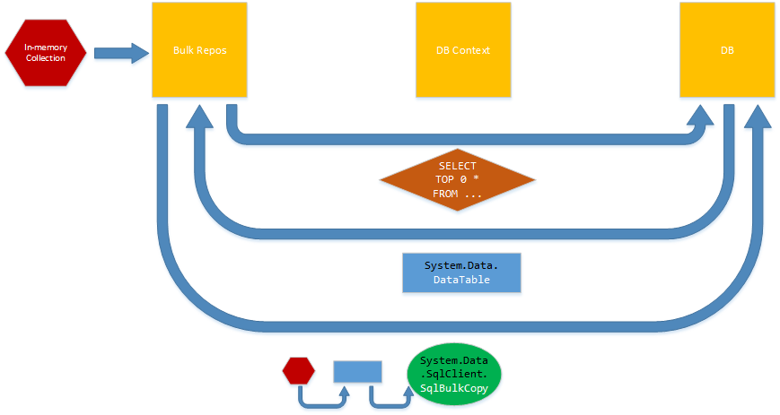
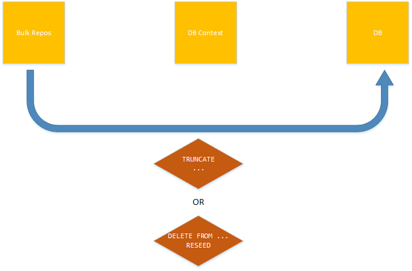
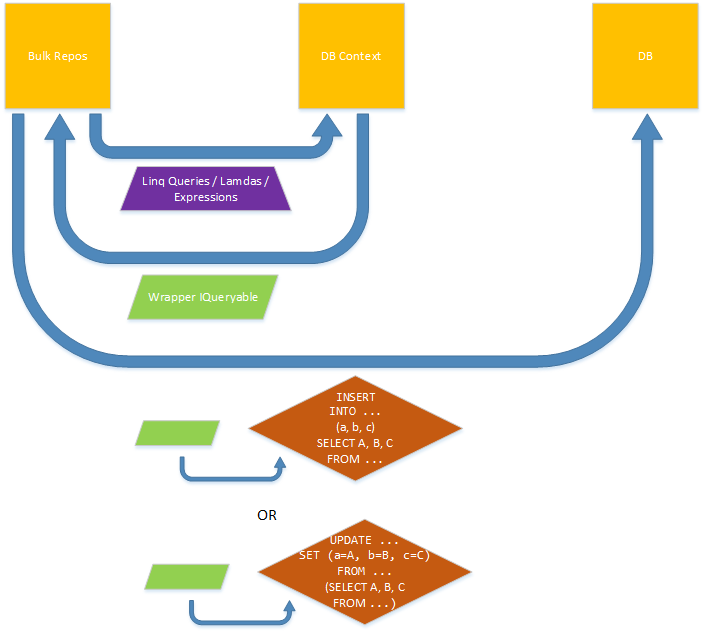
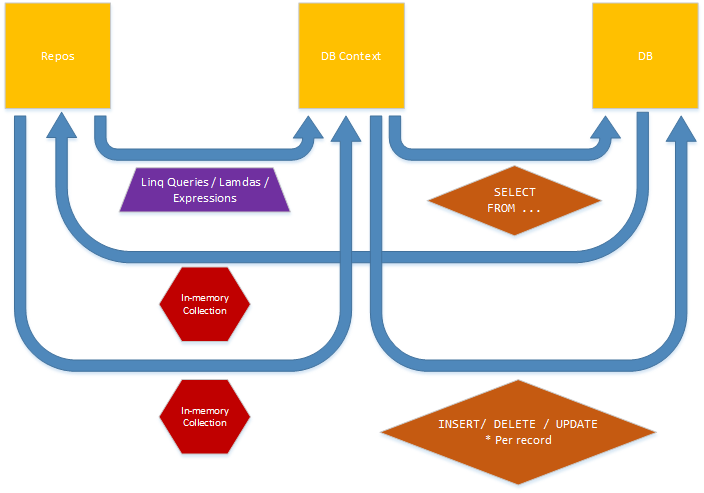

# EF6

Bsg.EF6 is a .Net based framework, extending Microsoft's Entity Framework 6 (Code First) with a specific focus on bulk operations.
The framework is used internally by the .Net teams at [Business Systems Group](http://www.bsg.co.za/) when working with Entity Framework 6. 

### What is its purpose?
The aim of the framework is leverage off the DbContext's standard functionality to automatically generate raw sql from strongly-typed IQueryables
and then combine these parameterised SELECT SQL statements with custom SQL to perform bulk SQL operations (INSERTS, UPDATES, DELETES etc.) in one command, directly on the SQL server without requiring the DbConext to submit multiple requests from the Application Layer.

### What are the advantages to using it?
Using this framework can reduce the work load and memory requirements on the Application Server, reduce the number of (and frequeny of opening and closing) connections required to communicate with the Database Server and significantly reduce the network traffic between the two. Whilst at the same time still leveraging most of the usual benefits of a traditional ORM. 

### What does this actually mean?
It means you can run bulk update, insert and delete SQL statements directly on the Database server, but still make use of a ORM.
I.e. you get the performance of SQL and the usability of the ORM.

### How is this different from other Bulk EF frameworks?
For some parts, its very similar especially with regards to the BulkAdd, BulkDelete and BulkUpdate type functionality.
Its more unique value proposition comes from the SelectAndAdd and SelectAndUpdate methods, 
which allow for bulk (many) and unique (per row) updates and inserts without sending any additional data across the network (assuming all the data needed for the update or insert already resides within the Database) 

## BulkDelete & BulkUpdate

#### Overview
*TODO*
#### When To Use
*TODO*
#### Example
*TODO*
#### Overloads
*TODO*

## BulkAdd

#### Overview
*TODO*
#### When To Use
*TODO*
#### Example
*TODO*
#### Overloads
*TODO*

## Truncate

#### Overview
*TODO*
#### When To Use
*TODO*
#### Example
*TODO*
#### Overloads
*TODO*

## BulkSelectAndAdd & BulkSelectAndUpdate

#### Overview
*TODO*
#### When To Use
*TODO*
#### Example
*TODO*
#### Overloads
*TODO*

## Traditional Entity Framework

#### Overview
*TODO*
#### When To Use
*TODO*
#### Example
*TODO*
#### Overloads
*TODO*

## Getting Started
The topics below should give a brief introduction to the more important components of the framework.
Alternatively the Bsg.Ef6.Tests project can also be seen as a mini POC showing how to setup the IOC containers, how to create custom DbContexts, how to create domain entities, configurations, context repos, entities repos and most importantly how to use the various methods of the abstract bulk repos defined in the framework.

*Note: the that all the Contexts (Primary, Secondary), Entities (Alpha, Beta, One, Two etc.) and all their properties within the test projectsare completely arbitary ito their names.*

### DI & Built-In Services
*TODO*
### Ef6Context
*TODO*
### Repository Pattern
*TODO*
### Generic Repository
*TODO*
### Context Repository
*TODO*
### Entity Repository
*TODO* 
### IWrapperEntity
*TODO*
### EntityTypeConfiguration
*TODO*
### Transactions
*TODO*
### app.config
*TODO*

## Limitations
### Code First
*TODO*
### SelectAndX : Projections using IWrapperEntity
*TODO*
### SelectAndX : Projections and order of properties
*TODO*
### Primary Keys
*TODO*
### Collections
*TODO*
### BulkAdd and SqlServer
*TODO*
### Parallel Operations in same container scope
*TODO*
### Nuget Package
*TODO*

